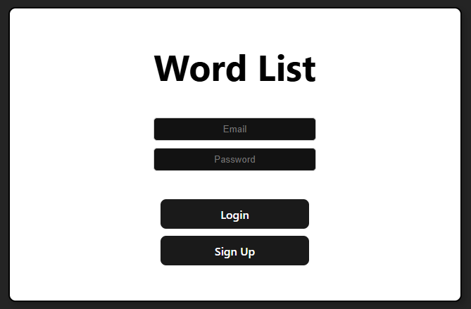
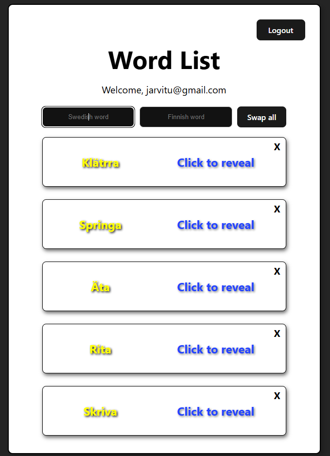

# This project was created using vite + react

## Language app project

I made this language app for learning swedish words. This project was made for myself from self interest. I used firebase's realtime database as backend. Authentication is also done via firebase using email and password. Anyone can make an account and start using this app.

### Pictures of the app

